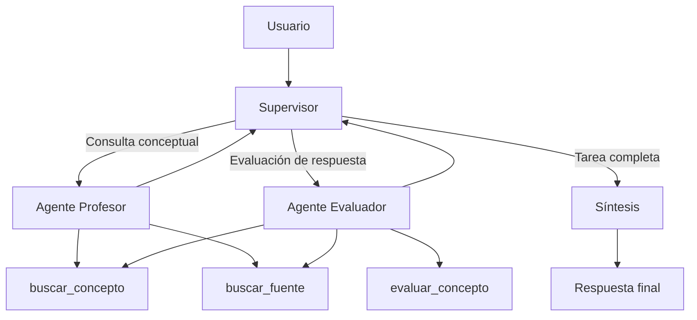

# Orquestador multi-agente especializado (Pre-Entrega 6)

Proyecto correspondiente a la Pre-Entrega 6 del curso de AI Engineering.

## Descripción

Orquestador multi-agente especializado implementado con LangGraph y LangChain, utilizando un Supervisor y dos agentes especialistas para resolver consultas relacionadas con metodología de la investigación y estadística.

El sistema implementa una arquitectura jerárquica en la que un Supervisor analiza la tarea del usuario y decide qué agente especializado debe intervenir:

* **Agente de Búsqueda/Investigación (`agente_profesor`)**: busca información conceptual y fuentes dentro de la base documental mediante recuperación híbrida.
* **Agente de Análisis/Cómputo (`agente_evaluador`)**: analiza respuestas proporcionadas por el usuario y calcula una medida de similitud semántica entre la respuesta conceptual ingresada por el usuario y los documentos recuperados para clasificar el nivel de conocimiento demostrado.

Los agentes utilizan herramientas especializadas y comparten un estado estructurado mediante `AgentState`.

El sistema permite:

* Recibir consultas en lenguaje natural.
* Determinar qué agente especializado debe intervenir según la tarea.
* Utilizar un Supervisor para coordinar la ejecución.
* Buscar conceptos y explicaciones en documentos académicos.
* Buscar fuentes y páginas relacionadas con un tema.
* Evaluar respuestas proporcionadas por el usuario.
* Calcular similitud semántica mediante embeddings y similitud del coseno.
* Clasificar las respuestas en las categorías `Mal`, `Incompleta`, `Bien` y `Muy bien`.
* Utilizar un retriever híbrido basado en BM25 y búsqueda vectorial.
* Mantener un estado compartido entre los diferentes nodos del grafo.
* Persistir el estado de las conversaciones mediante SQLite y `thread_id`.
* Limitar el número máximo de pasos del Supervisor.
* Utilizar diferentes proveedores LLM mediante un mecanismo de fallback.
* Generar una respuesta final mediante un nodo de síntesis.
* Registrar eventos relevantes mediante `logging`.
* Generar trazas de ejecución en formato JSON.
* Clasificar errores provenientes de los proveedores LLM y de las herramientas.
* Ejecutar operaciones de manera asíncrona.
* Ejecutar pruebas automatizadas mediante `pytest` y `pytest-asyncio`.
* Ejecutar los tests automáticamente mediante GitHub Actions.

## Correspondencia con la consigna

La arquitectura implementada corresponde a los componentes solicitados en la consigna de la siguiente manera:

| Requisito de la consigna         | Implementación                            |
| -------------------------------- | ----------------------------------------- |
| Supervisor                       | `agents/supervisor.py`                    |
| Agente de Búsqueda/Investigación | `agents/profesor.py`                      |
| Agente de Análisis/Cómputo       | `agents/evaluador.py`                     |
| Estado compartido estructurado   | `AgentState` en `schemas.py`              |
| Herramientas funcionales         | `tools.py`                                |
| Orquestación mediante grafo      | `graph_config.py`                         |
| Validación de resultados         | Decisión del Supervisor antes de `FINISH` |
| Memoria/persistencia             | `AsyncSqliteSaver`                        |
| Síntesis de resultados           | `agents/sintesis.py`                      |
| Pruebas automatizadas            | `tests/`                                  |
| Evidencia de ejecución           | `traces/`                                 |

### Agente de Búsqueda/Investigación

El requisito de **Agente de Búsqueda/Investigación** se implementa mediante `agente_profesor`.

Este agente está especializado en consultas conceptuales y utiliza las herramientas:

* `buscar_concepto`: recupera contenido relevante de los documentos disponibles.
* `buscar_fuente`: recupera las fuentes y páginas relacionadas con un tema.

El agente utiliza un retriever híbrido que combina recuperación mediante BM25 y búsqueda vectorial.

### Agente de Análisis/Cómputo

El requisito de **Agente de Análisis/Cómputo** se implementa mediante `agente_evaluador`.

Este agente analiza las respuestas proporcionadas por el usuario. Su herramienta principal, `evaluar_concepto`, recupera documentos relacionados con el tema, genera embeddings para la respuesta del usuario y para los documentos recuperados y calcula la similitud semántica mediante similitud del coseno.

A partir del valor obtenido se clasifica la respuesta en cuatro categorías:

* `Mal`
* `Incompleta`
* `Bien`
* `Muy bien`

Además, el agente puede utilizar `buscar_fuente` y `buscar_concepto` para proporcionar información que permita al estudiante comprender y mejorar su respuesta.

Los umbrales utilizados son heurísticos y no pretenden representar una escala empíricamente calibrada.

### Supervisor

El requisito de orquestación jerárquica se implementa mediante `nodo_supervisor`.

El Supervisor utiliza una salida estructurada mediante `DecisionSupervisor`, que restringe sus decisiones a:

```text
profesor
evaluador
FINISH
```

El Supervisor determina qué especialista debe intervenir y, después de recibir su aporte, vuelve a evaluar si la tarea está suficientemente resuelta.

Si el aporte del especialista es suficiente, selecciona `FINISH`. En ese caso, el grafo continúa hacia el nodo de síntesis.

También se establece un límite máximo de pasos mediante `MAX_PASOS` para evitar ciclos indefinidos.

## Requisitos

### Mínimos

* Python 3.12+ según la especificación de la consigna.
* API key de Google Gemini.
* API key de Pinecone.
* Un índice de Pinecone configurado para almacenar los embeddings de los documentos.

### Extras

* API key de OpenAI.
* API key de Anthropic.

Los proveedores OpenAI y Anthropic se encuentran contemplados como alternativas dentro del mecanismo de fallback.

### Versión de Python utilizada

Si bien la consigna especifica Python 3.12+, durante el desarrollo de esta entrega se utilizó Python 3.11.x debido a incompatibilidades de dependencias identificadas durante la entrega anterior.

La versión 3.11 se mantuvo con el objetivo de facilitar la ejecución del proyecto en el entorno de evaluación y mantener la compatibilidad del conjunto de dependencias utilizado.

El entorno de CI de GitHub Actions utiliza la misma versión para reproducir el entorno utilizado durante el desarrollo y ejecutar los tests.

## Entorno virtual

El proyecto utiliza un entorno virtual de Python mediante `venv`.

### Crear el entorno virtual

```bash
python -m venv .venv
```

### Activarlo en Windows

```bash
.venv\Scripts\activate
```

### Activarlo en Linux/macOS

```bash
source .venv/bin/activate
```

### Instalar las dependencias

```bash
pip install -r requirements.txt
```

Las dependencias del proyecto se encuentran documentadas en `requirements.txt`.

El directorio `.venv` no se incluye en el repositorio y se encuentra excluido mediante `.gitignore`.

## Tecnologías utilizadas

- Python
- asyncio
- Pydantic
- LangChain
- LangChain Core
- LangGraph
- LangGraph Checkpoint SQLite
- LangChain Google GenAI
- LangChain OpenAI
- LangChain Anthropic
- Pinecone
- Hugging Face
- Sentence Transformers
- scikit-learn
- BM25
- tiktoken
- pytest
- pytest-asyncio
- Ruff
- GitHub Actions

## Variables de entorno

El proyecto utiliza las siguientes variables de entorno:

* `GOOGLE_API_KEY`
* `OPENAI_API_KEY`
* `ANTHROPIC_API_KEY`
* `PINECONE_API_KEY`
* `INDEX_NAME`

Crear un archivo `.env` a partir de `.env.example` y completar las variables correspondientes, en caso de no encontrarse configuradas como variables de entorno del sistema.

Las claves reales no se incluyen en el repositorio.

Las variables `OPENAI_API_KEY` y `ANTHROPIC_API_KEY` son opcionales. El sistema las contempla como proveedores alternativos dentro del mecanismo de fallback.

## Arquitectura multi-agente

El sistema utiliza una topología jerárquica con un Supervisor que coordina dos agentes especializados.



Link original: https://mermaid.ai/d/ceb57e80-26df-478b-9dfe-8df3c492eb0b

El flujo general es:

```text
                    ┌─────────────────┐
                    │     Usuario     │
                    └────────┬────────┘
                             │
                             ▼
                    ┌─────────────────┐
                    │   Supervisor    │
                    └───────┬─────────┘
                            / \
                           /   \
                          ▼     ▼
                ┌────────────┐ ┌─────────────┐
                │  Profesor  │ │  Evaluador  │
                └─────┬──────┘ └──────┬──────┘
                      │                │
                      └───────┬────────┘
                              ▼
                       ┌─────────────┐
                       │ Supervisor  │
                       └──────┬──────┘
                              │
                         FINISH
                              │
                              ▼
                       ┌─────────────┐
                       │  Síntesis   │
                       └──────┬──────┘
                              │
                              ▼
                       Respuesta final
```

La elección de esta topología permite separar las responsabilidades de búsqueda y análisis y centralizar la coordinación en el Supervisor.

## Estado compartido

El grafo utiliza `AgentState`, definido en `schemas.py`, como estado compartido.

`AgentState` hereda de `MessagesState` y agrega información específica del workflow:

* `next_agent`: próximo agente seleccionado por el Supervisor.
* `contribuciones`: aportes generados por los agentes.
* `pasos`: cantidad de pasos ejecutados.
* `task_completed`: indica si el Supervisor determinó que la tarea está completa.

Las contribuciones se acumulan mediante un reducer basado en `operator.add`.

Este estado permite que los distintos nodos del grafo compartan información sin depender de variables globales.

## Supervisor

El Supervisor utiliza un modelo con salida estructurada mediante `DecisionSupervisor`.

```python
class DecisionSupervisor(BaseModel):
    next: Literal["profesor", "evaluador", "FINISH"]
    razon: str
```

El Supervisor puede seleccionar:

* `profesor` para consultas conceptuales.
* `evaluador` cuando el usuario proporciona una respuesta que debe ser evaluada.
* `FINISH` cuando la tarea ya fue resuelta.

Después de cada intervención de un especialista, el Supervisor vuelve a evaluar el estado de la tarea.

El sistema también establece:

```python
MAX_PASOS = 6
```

Si se alcanza este límite, el Supervisor finaliza el workflow para evitar ciclos indefinidos.

## Agente Profesor

El `agente_profesor` está especializado en búsqueda e investigación de información conceptual.

Utiliza `create_agent()` de LangChain y dispone de dos herramientas:

### `buscar_concepto`

Recupera fragmentos relevantes de la base documental mediante el retriever híbrido.

Se utiliza para responder preguntas como:

```text
¿Qué es la correlación?
¿Qué es la regresión?
¿Qué significa validez interna?
```

### `buscar_fuente`

Recupera las fuentes y páginas asociadas con un tema.

Se utiliza cuando el usuario solicita información bibliográfica o desea saber dónde estudiar un concepto.

El agente tiene instrucciones para utilizar una herramienta por vez y esperar el resultado antes de solicitar otra.

## Agente Evaluador

El `agente_evaluador` está especializado en el análisis de respuestas de estudiantes.

Su herramienta principal es `evaluar_concepto`.

El proceso implementado por esta herramienta es:

```text
Respuesta del usuario
        ↓
Recuperación de documentos
        ↓
Embedding de la respuesta
        ↓
Embeddings de los documentos
        ↓
Similitud del coseno
        ↓
Valor de similitud
        ↓
Clasificación
```

Los umbrales utilizados son:

```text
< 0.55       → Mal
0.55 - <0.70 → Incompleta
0.70 - <0.90 → Bien
≥ 0.90       → Muy bien
```

La evaluación es una heurística basada en similitud semántica y no constituye una métrica empíricamente calibrada del conocimiento del estudiante.

Además de `evaluar_concepto`, el agente puede utilizar:

* `buscar_fuente`
* `buscar_concepto`

Estas herramientas permiten complementar la evaluación con información conceptual y bibliográfica.

La respuesta final del agente comienza siempre indicando explícitamente la categoría obtenida mediante `evaluar_concepto`.

## Herramientas y recuperación híbrida

El sistema utiliza tres herramientas principales:

* `buscar_concepto`
* `buscar_fuente`
* `evaluar_concepto`

La recuperación documental utiliza un retriever híbrido compuesto por:

* `BM25Retriever`
* búsqueda vectorial sobre Pinecone

Los resultados se combinan mediante `EnsembleRetriever`.

La configuración utilizada asigna mayor peso a la recuperación vectorial:

```text
BM25       → 0.25
Vectorial  → 0.75
```

Ambos retrievers utilizan `k = 5`.

La recuperación híbrida permite combinar coincidencia léxica con similitud semántica.

## Síntesis

Cuando el Supervisor selecciona `FINISH`, el grafo continúa hacia `nodo_sintesis`.

El nodo de síntesis recibe:

* la pregunta original;
* las contribuciones realizadas por los agentes.

A partir de esa información genera una respuesta final para el usuario.

La síntesis permite separar la coordinación de los agentes de la generación de la respuesta final y evita que el usuario deba recibir directamente la salida interna del workflow.

El nodo de síntesis no expone la arquitectura interna ni el proceso de coordinación al usuario.

## Fallback de proveedores LLM

Los nodos principales utilizan un mecanismo de fallback entre proveedores:

```text
OpenAI
   ↓ si falla
Anthropic
   ↓ si falla
Gemini
```

El mecanismo se implementa en los nodos del Supervisor, Profesor, Evaluador y Síntesis.

Cuando un proveedor genera una excepción, el error es clasificado y registrado y se intenta utilizar el siguiente proveedor disponible.

Esto permite continuar la ejecución cuando un proveedor presenta problemas de credenciales, cuota o disponibilidad.

## Memoria persistente

La memoria del sistema se implementa mediante `AsyncSqliteSaver`.

El estado de cada conversación se identifica mediante un `thread_id`.

Por ejemplo:

```python
CONFIG = {
    "configurable": {
        "thread_id": "multiagente-1_evaluador_mal"
    },
    "recursion_limit": 10,
}
```

El mismo `thread_id` permite recuperar el estado persistido de una conversación en interacciones posteriores.

La persistencia se almacena localmente mediante SQLite.

El sistema utiliza además un `recursion_limit` para establecer un límite de seguridad sobre la ejecución del grafo.

## Manejo de errores

Se implementó una clasificación de errores mediante `LLMErrorType` y la excepción personalizada `LLMError`.

Actualmente se contemplan:

* `KEY`: credenciales inválidas o no autorizadas.
* `RATE_LIMIT`: límite de solicitudes o cuota alcanzada.
* `UNKNOWN`: error no contemplado específicamente.

Los errores se clasifican antes de ser registrados para evitar exponer información sensible del proveedor en los logs.

Las herramientas también clasifican los errores producidos durante la recuperación documental o el cálculo de la evaluación.

## Logging

Se incorporó el módulo estándar `logging` de Python para registrar eventos relevantes durante la ejecución.

Los mensajes se clasifican según su nivel:

* `INFO`: proveedores utilizados, ejecución de herramientas y eventos normales.
* `WARNING`: errores recuperables de proveedores.
* `ERROR`: errores que impiden completar una operación.

Los logs permiten observar el flujo de ejecución y facilitar la identificación de errores sin registrar claves de API.

## Testing

Se incorporaron pruebas automatizadas utilizando `pytest` y `pytest-asyncio`.

Las pruebas se diseñaron para verificar los componentes principales del sistema sin depender de llamadas reales a los proveedores LLM cuando no es necesario.

Se incluyen pruebas para:

* Decisiones del Supervisor.
* Límite máximo de pasos del Supervisor.
* Fallback entre proveedores.
* Ejecución del agente Profesor.
* Ejecución del agente Evaluador.
* Ejecución del nodo de Síntesis.
* Clasificación de resultados de `evaluar_concepto`.
* Clasificación de errores de las herramientas.
* Funcionamiento del grafo completo.
* Flujo Profesor → Supervisor → Síntesis.
* Flujo Evaluador → Supervisor → Síntesis.
* Persistencia de memoria entre diferentes turnos.
* Serialización de mensajes y llamadas a herramientas.
* Guardado de trazas independientes.

Las llamadas a agentes y proveedores LLM se simulan mediante *mocking* cuando la prueba busca verificar exclusivamente la lógica del nodo o del grafo.

### Ejecución de los tests

Los tests pueden ejecutarse mediante:

```bash
pytest -v
```

El proyecto también cuenta con un workflow de GitHub Actions que ejecuta automáticamente los tests ante nuevos `push` y `pull_request`.

El workflow instala las dependencias mediante `requirements.txt` y ejecuta:

```bash
pytest tests/ --ignore=tests/integration
```

Las credenciales necesarias para la infraestructura de Pinecone y los proveedores LLM se configuran mediante GitHub Secrets.

## Trazas de ejecución

El proyecto genera trazas de las ejecuciones en formato JSON.

Las trazas permiten observar:

* mensajes del usuario;
* respuestas de los agentes;
* llamadas a herramientas;
* resultados de herramientas;
* participación del Supervisor;
* secuencia de ejecución.

Un flujo típico puede representarse como:

```text
HumanMessage
      ↓
Supervisor
      ↓
AIMessage
      ↓
Tool Call
      ↓
ToolMessage
      ↓
AIMessage
      ↓
Supervisor
      ↓
Síntesis
      ↓
Respuesta final
```

Las trazas incluidas en el directorio `traces/` corresponden a ejecuciones reales del sistema.

La traza representa el ciclo de ejecución observable del agente; no contiene ni pretende representar razonamientos internos no expuestos por el modelo.

## Ejecución

El script principal permite ejecutar el orquestador.

Para ejecutar el sistema:

```bash
python main.py
```

Durante la ejecución, el sistema:

1. Recibe la consulta del usuario.
2. Inicializa o recupera el estado asociado al `thread_id`.
3. Ejecuta el Supervisor.
4. El Supervisor selecciona un agente especializado.
5. El agente utiliza las herramientas disponibles cuando resulta necesario.
6. El resultado del agente se incorpora al estado compartido.
7. El Supervisor vuelve a evaluar la tarea.
8. Cuando la tarea está completa, se ejecuta el nodo de síntesis.
9. Se genera la respuesta final.
10. Se guarda la traza de ejecución.

## Estructura del proyecto

```text
├── agents/
│   ├── __init__.py
│   ├── supervisor.py
│   ├── profesor.py
│   ├── evaluador.py
│   └── sintesis.py
│
├── tests/
│   ├── test_supervisor.py
│   ├── test_profesor.py
│   ├── test_evaluador.py
│   ├── test_sintesis.py
│   ├── test_graph.py
│   ├── test_tools.py
│   └── test_memory.py
│
├── traces/
│   ├── multiagente-1_evaluador_incompleta.json
│   └── multiagente-1_profesor.json
│
├── chunking.py               # Limpieza y división de documentos
├── graph_config.py           # Construcción y conexión del StateGraph
├── schemas.py                # Estado compartido y modelos estructurados
├── db_config.py              # Configuración de embeddings y Pinecone
├── db_ingest.py              # Ingesta y configuración de infraestructura RAG
├── retriever.py              # Configuración del retriever híbrido
├── tools.py                  # Herramientas disponibles para los agentes
├── models.py                 # Configuración de proveedores LLM
├── errors.py                 # Clasificación y manejo de errores
├── logging_config.py         # Configuración del sistema de logs
├── trace_utils.py            # Serialización y guardado de trazas
├── main.py                   # Punto de entrada y ejecución
├── setup.py                  # Procesamiento de documentos
├── .env.example              # Ejemplo de variables de entorno
├── .gitignore
├── pytest.ini
├── requirements.txt
└── README.md
```

Los archivos SQLite utilizados para los checkpoints y otros archivos generados durante la ejecución se almacenan localmente y se encuentran excluidos del repositorio mediante `.gitignore`.

## Calidad y buenas prácticas

El proyecto utiliza Ruff como herramienta de análisis y formateo del código.

Para formatear automáticamente el proyecto:

```bash
ruff format .
```

Para analizar el código sin modificarlo:

```bash
ruff check .
```

También se utilizan:

* Type Hints.
* Pydantic para modelos estructurados.
* Funciones asíncronas mediante `async def`.
* `await` para operaciones asíncronas.
* Excepciones personalizadas.
* *Mocking* en pruebas unitarias.
* Variables de entorno para las credenciales.
* Estado compartido mediante `AgentState`.
* Salidas estructuradas para las decisiones del Supervisor.
* `recursion_limit` y `MAX_PASOS` para limitar ciclos.
* Persistencia mediante SQLite.
* GitHub Actions para integración continua.

## Sobre el código

El proyecto fue desarrollado tomando como referencia:

* Código y ejemplos proporcionados por el profesor como guía para la Pre-Entrega 6.
* Ejemplos y contenidos incluidos en el temario de la plataforma sobre agentes, LangGraph, herramientas, RAG y sistemas multi-agente.
* Documentación oficial y recursos disponibles en Internet.
* ChatGPT como herramienta de asistencia durante el desarrollo.
